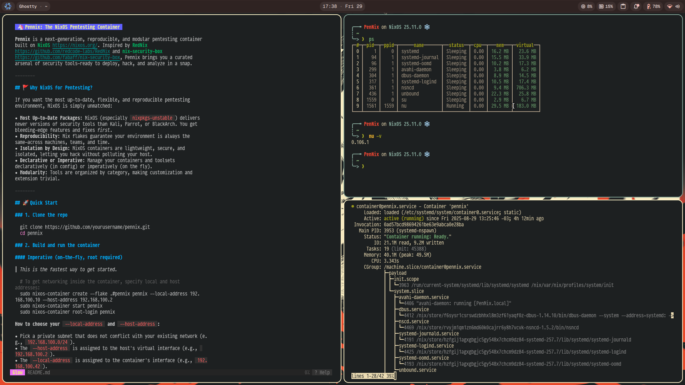
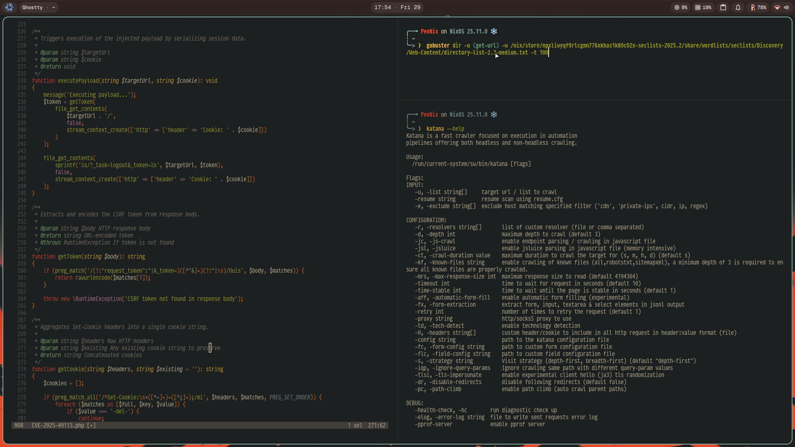
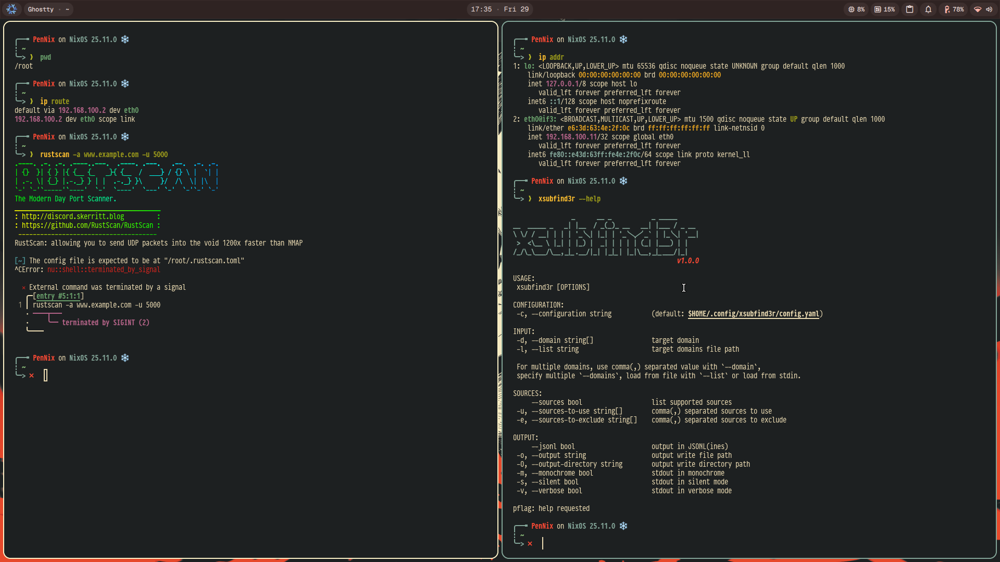

# 🦄 Pennix: The NixOS Pentesting Container

**Pennix** is a next-generation, reproducible, and modular pentesting container built on [NixOS](https://nixos.org/). Inspired by [RedNix](https://github.com/redcode-labs/RedNix) and [nix-security-box](https://github.com/fabaff/nix-security-box), Pennix brings you a curated arsenal of security tools—ready to deploy, hack, and analyze in a snap.

|                                                                         |
| ----------------------------------------------------------------------- |
|  |

|                                                      |                                                      |
| ---------------------------------------------------- | ---------------------------------------------------- |
|  |  |

---

## 🚩 Why NixOS for Pentesting?

If you want the most up-to-date, flexible, and reproducible pentesting environment, NixOS is simply unmatched:

- **Most Up-to-Date Packages**: NixOS (especially `nixpkgs-unstable`) delivers newer versions of security tools than Kali, Parrot, or BlackArch. You get bleeding-edge features and fixes _first_.
- **Reproducibility**: Nix flakes guarantee your environment is always the same—across machines, teams, and time.
- **Isolation by Design**: NixOS containers are lightweight, secure, and isolated, letting you hack without polluting your host.
- **Declarative or Imperative**: Manage your containers and toolsets declaratively (in config) or imperatively (on the fly).
- **Modularity**: Tools are organized by category, making customization and extension trivial.

---

## 🚀 Quick Start

### 1. Clone the repo

```sh
git clone https://github.com/linuxmobile/pennix.git
cd pennix
```

### 2. Build and run the container

#### Imperative (on-the-fly, root required)

> _This is the fastest way to get started._

```sh
# To get networking inside the container, specify local and host addresses:
sudo nixos-container create --flake .#pennix pennix --local-address 192.168.100.10 --host-address 192.168.100.2
sudo nixos-container start pennix
sudo nixos-container root-login pennix
```

**How to choose your `--local-address` and `--host-address`:**

- Pick a private subnet that does not conflict with your existing network (e.g., `192.168.100.0/24`).
- The `--host-address` is assigned to the host's virtual interface (e.g., `192.168.100.2`).
- The `--local-address` is assigned to the container's interface (e.g., `192.168.100.42`).
- Make sure both addresses are unique and not used elsewhere on your system.

**How to check which addresses are available:**

- Use the `ip addr` command on your host to see which subnets are already in use.
- Choose two unused addresses from your chosen subnet.

**Example:**

```sh
# Check existing interfaces and subnets
ip addr

# Pick addresses not in use, e.g.:
sudo nixos-container create --flake .#pennix pennix --local-address 192.168.100.42 --host-address 192.168.100.2
```

**After creation, to see the container's IP:**

```sh
sudo nixos-container show-ip pennix
```

- The container will be built and started. You can log in as root or as the default user (`pennix` / password: `pennix`).
- To check status: `systemctl status container@pennix`
- To destroy: `nixos-container destroy pennix`

- The container will be built and started. You can log in as root or as the default user (`pennix` / password: `pennix`).
- To check status: `systemctl status container@pennix`
- To destroy: `nixos-container destroy pennix`

#### Declarative (add to your system config)

> _For full reproducibility and auto-updates._

Add Pennix as an input to your system flake, then in your `configuration.nix`:

```nix
{
  inputs.pennix.url = "github:yourusername/pennix";
  outputs = { self, nixpkgs, ... }@inputs: {
    nixosConfigurations.yourhost = nixpkgs.lib.nixosSystem {
      # ...
      imports = [
        inputs.pennix.container
      ];
    };
  };
}
```

- Rebuild your system: `nixos-rebuild switch`
- Start/stop container: `systemctl start container@pennix` / `systemctl stop container@pennix`
- To autostart: add `containers.pennix.autoStart = true;` to your config.

---

## 🛡️ Networking & Isolation

- By default, Pennix uses a private virtual Ethernet network (`192.168.100.0/24`).
- NAT is pre-configured for outbound access.
- Port forwarding is set up for SSH (`host:2222 → container:22`) and HTTP (`host:8080 → container:80`).
- You can customize addresses and ports in `container.nix`.

---

## 🛠️ What’s Inside?

- **Hundreds of tools** for pentesting, forensics, fuzzing, cloud, wireless, Windows, web, and more.
- **Nushell** as the default shell, with custom aliases, completions, and a beautiful Starship prompt.
- **Home Manager**-style profile in PATH.
- **Easy customization**: Just edit the Nix files in `pkgs/` or add your own modules.

---

## 🧩 Project Structure

```
pennix/
├── flake.nix                # Flake entrypoint, defines all outputs
├── container-config.nix     # Main NixOS configuration for the container
├── container.nix            # Container definition (networking, mounts, ports)
├── pkgs/                    # Tool categories, each as a Nix module
└── modules/                 # Shell and prompt configuration
```

---

## 🦾 Contributing

PRs, issues, and tool suggestions are welcome! Let’s make pentesting with Nix delightful.

---

## ❤️ Credits

- [RedNix](https://github.com/redcode-labs/RedNix) (and its [wiki](https://github.com/redcode-labs/RedNix/wiki/2.-Installation,-configuration-and-usage))
- [nix-security-box](https://github.com/fabaff/nix-security-box)
- The NixOS and infosec communities

---

## 📜 License

MIT. See [LICENSE](./LICENSE).

---

> _“Hack the planet, but reproducibly—with the freshest tools.”_
